# 📚 `llm-from-scratch` Technical Documentation Sitemap

Welcome to the documentation sitemap for **`llm-from-scratch`**. This repository provides complete mathematical, architectural, and low-level C/CUDA/Metal engine guides for building Large Language Models from first principles.

---

## 🗺️ Documentation Sitemap

```mermaid
flowchart TD
    Root["llm-from-scratch Docs"] --> Arch["🏛️ Architecture"]
    Root --> Quant["⚡ Quantization"]
    Root --> Train["🎓 Training & Fine-Tuning"]
    Root --> Theory["📐 Theoretical Foundations"]
    Root --> CEngine["💻 Bare-Metal Runtimes"]

    Arch --> A1["architecture.md (Pre-RMSNorm, RoPE, SwiGLU)"]
    Arch --> A2["moe_gqa.md (MoE & Grouped Query Attention)"]
    Arch --> A3["flash_attention.md (Educational FlashAttention)"]
    Arch --> A4["mla.md (DeepSeek Multi-Head Latent Attention)"]
    Arch --> A5["nano_llm.md (NanoLLM Weight Tying)"]

    Quant --> Q1["bitnet.md (1.58-Bit Ternary BitNet b1.58)"]

    Train --> T1["training.md (Training Pipeline & CrossEntropy)"]
    Train --> T2["lora.md (Low-Rank Adaptation & Weight Merging)"]
    Train --> T3["distillation.md (Teacher Knowledge Distillation)"]

    Theory --> M1["math.md (Mathematical Forward & Backward Formulas)"]
    Theory --> M2["tokenizer.md (Byte-Pair Encoding Algorithm)"]

    CEngine --> C1["c/ARCH.md (C, CUDA, & Apple Silicon Metal Engines)"]
```

---

## 🏛️ 1. Model Architecture Guides (`docs/architecture/`)

| Document | Topic | Key Concepts |
| :--- | :--- | :--- |
| **[Architecture Overview](architecture/architecture.md)** | Core Llama-3 Style LLM | Pre-RMSNorm, Rotary Position Embeddings (RoPE), SwiGLU Feed-Forward Networks. |
| **[GQA & MoE Guide](architecture/moe_gqa.md)** | Scalable Attention & Sparsity | Grouped Query Attention (GQA), Top-K Expert Routing, Load-Balancing Auxiliary Loss. |
| **[Educational FlashAttention](architecture/flash_attention.md)** | Memory-Efficient Attention | Dao et al. block-tiled online softmax algorithm for zero $N \times N$ matrix memory allocation. |
| **[Multi-Head Latent Attention](architecture/mla.md)** | DeepSeek-V3 / R1 Attention | Low-rank latent KV compression ($c^{KV}$) and decoupled RoPE keys ($K^R$). |
| **[NanoLLM Weight Tying](architecture/nano_llm.md)** | Ultra-Compact Memory | Memory sharing between `tok_embeddings` and `output` head for sub-1.2MB model footprints. |

---

## ⚡ 2. Quantization & Efficient Inference (`docs/quantization/`)

| Document | Topic | Key Concepts |
| :--- | :--- | :--- |
| **[1.58-Bit BitNet b1.58 Guide](quantization/bitnet.md)** | Ternary Quantization | Microsoft BitNet b1.58 $\{-1, 0, +1\}$ ternary weight quantization, STE autograd, addition-only matrix algebra. |

---

## 🎓 3. Training & Fine-Tuning Guides (`docs/training/`)

| Document | Topic | Key Concepts |
| :--- | :--- | :--- |
| **[Training Pipeline](training/training.md)** | Autoregressive Training | Dataset ingestion, token shifting, AdamW optimizer, CrossEntropy loss backward pass. |
| **[LoRA Fine-Tuning](training/lora.md)** | Parameter-Efficient Tuning | Low-Rank Adaptation rank decomposition ($W_0 + \frac{\alpha}{r} B \cdot A$), parameter freezing, weight merging. |
| **[Knowledge Distillation](training/distillation.md)** | Model Distillation | Transferring intelligence from 7B+ teacher models (Qwen 2.5 / DeepSeek) into TinyLLM. |

---

## 📐 4. Theoretical Foundations (`docs/theory/`)

| Document | Topic | Key Concepts |
| :--- | :--- | :--- |
| **[Mathematical Foundations](theory/math.md)** | Theoretical Formulas | Mathematical equations governing every layer from embedding lookup to Softmax output. |
| **[Tokenizer Mechanics](theory/tokenizer.md)** | Subword Tokenization | Byte-Pair Encoding (BPE) training pair frequency merges, subword vocabulary decoding. |

---

## 💻 5. Bare-Metal Engine Architectures (`c/`)

| Document | Topic | Key Concepts |
| :--- | :--- | :--- |
| **[C & Hardware Engines Architecture](../c/ARCH.md)** | Bare-Metal Systems | Memory-mapped C engines (`run.c`, `runq.c`), NVIDIA CUDA grid kernels (`run.cu`), Apple Silicon Metal Shaders (`run_metal.m`). |

---

## 📖 Recommended Reading Order for Students

1. **Step 1**: Start with **[Tokenizer Mechanics](theory/tokenizer.md)** to understand subword representation.
2. **Step 2**: Read **[Architecture Overview](architecture/architecture.md)** and **[Mathematical Foundations](theory/math.md)** to understand the forward pass math.
3. **Step 3**: Explore **[Training Pipeline](training/training.md)** to learn how the model learns.
4. **Step 4**: Dive into **[1.58-Bit BitNet b1.58](quantization/bitnet.md)** and **[Multi-Head Latent Attention](architecture/mla.md)** for modern SOTA architecture techniques.
5. **Step 5**: Read **[C & Hardware Engines Architecture](../c/ARCH.md)** to see how models execute on bare-metal hardware.
