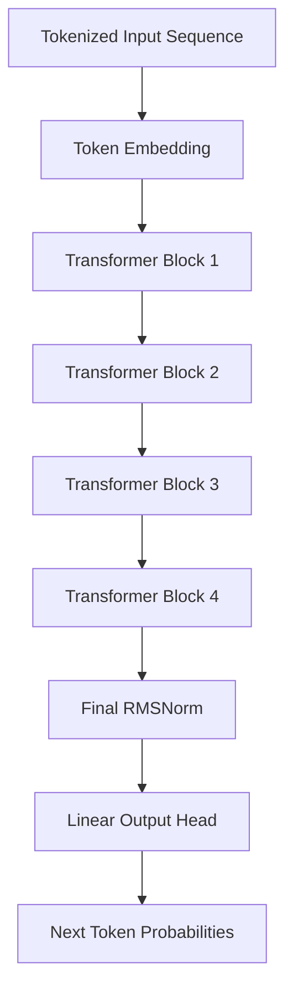
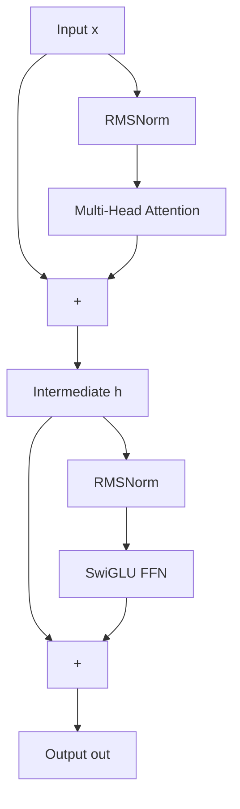

# TinyLLM Architecture

TinyLLM is a custom-built, lightweight Causal Language Model designed for educational purposes, experimentation, and mechanistic interpretability. Its architecture is heavily inspired by modern state-of-models like **Meta's LLaMA**, focusing on efficiency and removing legacy architectural choices like biases and absolute positional embeddings.

Below is an extensive breakdown of its components.

## 1. High-Level Overview

The model is an auto-regressive, decoder-only Transformer model. It takes a sequence of token IDs, maps them to continuous vector representations, processes them through a stack of transformer blocks, and projects them back into the vocabulary space to predict the probability distribution of the next token.

**Default Hyperparameters**:
- `dim` (Hidden Dimension): 128
- `n_layers` (Transformer Blocks): 4
- `n_heads` (Attention Heads): 4
- `ffn_dim` (Feed-Forward Hidden Dimension): 512
- `max_seq_len`: 64

---

## 2. Token Embeddings
The model starts with a standard `nn.Embedding` layer that maps token IDs (from a pre-trained BPE/WordPiece tokenizer) into dense vectors of size `dim`.
Unlike some older models (like BERT or GPT-2), TinyLLM **does not** use learned absolute positional embeddings. Positional information is injected later via Rotary Position Embeddings (RoPE).

---

## 3. Pre-Normalization with RMSNorm
Throughout the model, normalization is applied **before** the attention and feed-forward sub-layers (Pre-Norm), rather than after (Post-Norm). This greatly improves training stability.

Instead of standard Layer Normalization (`LayerNorm`), TinyLLM uses **Root Mean Square Normalization (`RMSNorm`)**. 
- **Why?** `RMSNorm` removes the mean-centering operation of `LayerNorm`. By assuming the mean of the activations is near zero, it saves computation time without degrading model performance. It only scales the activations by their root mean square.

---

## 4. Rotary Position Embeddings (RoPE)
To give the model a sense of sequence order, it employs **Rotary Position Embeddings**.
- RoPE is applied inside the Attention mechanism directly to the Query (`xq`) and Key (`xk`) tensors.
- It encodes absolute positions using a rotation matrix, but its mathematical formulation ensures that the dot product between queries and keys depends only on their **relative** distance.
- This allows the model to generalize better to sequence lengths beyond what it was trained on.

---

## 5. Multi-Head Attention (MHA) & 6. SwiGLU FFN

The Transformer Block is the core engine of the model.

The `Attention` module is a standard dot-product attention mechanism but with a few modern tweaks:
- **No Biases**: The linear projections for Query, Key, Value, and the final Output (`wq`, `wk`, `wv`, `wo`) do not use bias terms (`bias=False`). This is a LLaMA convention that slightly reduces parameter count and simplifies the network without hurting performance.
- **Causal Masking**: A triangular mask containing `-inf` is applied to the attention scores before the softmax operation. This prevents tokens from "looking ahead" into the future during training, ensuring strictly auto-regressive generation.

The Feed-Forward layer processes the output of the attention mechanism token-by-token. 
Instead of a traditional two-layer MLP with a ReLU or GELU activation, TinyLLM uses a **SwiGLU** (Swish-Gated Linear Unit) architecture.

**Formula**:
`Output = (SiLU(x * W1) * (x * W3)) * W2`

- It requires three weight matrices (`W1`, `W2`, `W3`) instead of two.
- `W1` and `W3` project the input up to the `ffn_dim` (which is typically a multiple of the hidden `dim`, e.g., 512).
- The `SiLU` (Swish) activation function is applied to the `W1` branch, acting as a dynamic gate for the `W3` branch.
- This setup has been empirically proven by papers like PaLM and LLaMA to provide better downstream performance than standard MLPs for language modeling.

---

## 7. Output Head
After the final Transformer block, the hidden states pass through a final `RMSNorm`. 
They are then projected by a linear layer (`nn.Linear(dim, vocab_size, bias=False)`) into logits over the entire vocabulary space. A Softmax function (typically handled inside the CrossEntropy loss during training) converts these logits into probabilities.
