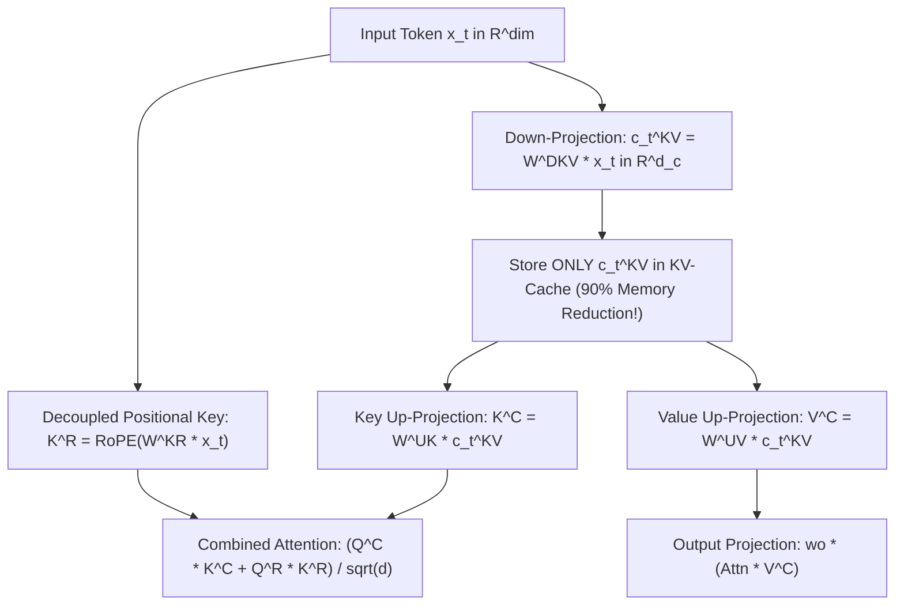

# Multi-Head Latent Attention (MLA): DeepSeek-V3 & DeepSeek-R1

This document explains the mathematical foundations, low-rank latent compression, and decoupled RoPE positional key mechanics of **Multi-Head Latent Attention (MLA)**.

---

## 1. Overview: The Memory Bottleneck of Standard Attention

In standard Multi-Head Attention (MHA) or Grouped Query Attention (GQA), key/value states are cached per head across all prompt tokens:

$$K \in \mathbb{R}^{B \times L \times n_h \times d_h}, \quad V \in \mathbb{R}^{B \times L \times n_h \times d_h}$$

As sequence length $L$ extends to 32k or 128k tokens, storing raw Key/Value matrices for every head exhausts GPU VRAM memory.

---

## 2. DeepSeek's Solution: Low-Rank Latent Compression ($c_t^{KV}$)

Instead of caching raw Key and Value matrices per head, **MLA compresses Key and Value projections into a shared low-rank latent vector $c_t^{KV}$**:

$$c_t^{KV} = W^{DKV} x_t \in \mathbb{R}^{d_c}$$

where $d_c \ll n_h \cdot d_h$ (the compression rank $d_c$ is much smaller than the full key-value dimension).



---

## 3. Decoupled Positional Keys ($K^R$)

Because $K^C = W^{UK} c_t^{KV}$ is a low-rank matrix, applying Rotary Embeddings (RoPE) directly to $K^C$ breaks matrix absorption.
DeepSeek solved this by **decoupling positional keys**:

* **Content Key**: $K_t^C = W^{UK} c_t^{KV}$
* **Positional Key**: $K_t^R = \text{RoPE}\left(W^{KR} x_t\right)$
* **Combined Attention Score**:

$$\text{Score}_{ij} = \frac{(Q_i^C)^T K_j^C + (Q_i^R)^T K_j^R}{\sqrt{d_h^C + d_R}}$$

---

## 4. Usage in PyTorch

```python
from tiny_llm import MultiHeadLatentAttention, precompute_freqs_cis

# Instantiate MLA module
mla = MultiHeadLatentAttention(
    dim=128,          # Model hidden dim
    n_heads=4,        # Number of query heads
    kv_lora_rank=32,  # Low-rank KV compression rank (dc)
    q_lora_rank=64,   # Query compression rank
    rope_dim=16,      # Decoupled RoPE dimension
)

x = torch.randn(2, 16, 128)
freqs_cis = precompute_freqs_cis(dim_head=16, end=32)

output = mla(x, freqs_cis)
# output shape: [2, 16, 128]
```
