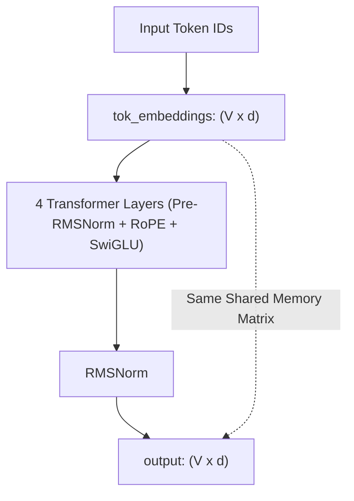

# NanoLLM: Weight-Tied Ultra-Compact LLM Architecture

This document explains the mathematical design and parameter savings of **NanoLLM**, an ultra-compact Llama-style Transformer model utilizing **Weight Tying** between the token embedding matrix and the output projection head.

---

## 1. Overview: The Vocabulary Parameter Bottleneck

In standard LLM architectures (like `TinyLLM`), the model allocates two separate $V \times d$ matrices for vocabulary operations:
1. `tok_embeddings.weight`: Maps input token IDs $\to$ hidden vectors ($V \times d$).
2. `output.weight`: Maps hidden vectors $\to$ logit probability distributions ($V \times d$).

For a vocabulary of $V = 4,000$ tokens and hidden dimension $d = 128$, storing both matrices consumes:

$$\text{Vocabulary Parameters} = 2 \times (4,000 \times 128) = 1,048,576 \text{ parameters } (\mathbf{4.19 \text{ MB in FP32}})$$

In a 2 Million parameter model, **vocabulary matrices account for >50% of the entire parameter budget!**

---

## 2. Weight Tying Mechanics (`self.output.weight = self.tok_embeddings.weight`)

Inspired by Press & Wolf (2017), GPT-2, and PaLM, **NanoLLM** ties the output linear projection matrix to share the exact same underlying memory buffer as the token embedding lookup table:

```python
# In NanoLLM.__init__()
self.tok_embeddings = nn.Embedding(vocab_size, dim)
self.output = nn.Linear(dim, vocab_size, bias=False)

# Weight Tying: Memory sharing
self.output.weight = self.tok_embeddings.weight
```



---

## 3. Parameter Savings Breakdown

| Architecture | Vocabulary Params | Transformer Layers | Total Params | Model Size (FP32) |
| :--- | :--- | :--- | :--- | :--- |
| **Standard `TinyLLM`** | 1,048,576 (2 matrices) | 1,025,152 | **2,073,728** | **7.91 MB** |
| 🚀 **Weight-Tied `NanoLLM`** | **512,000 (1 shared matrix)** | 1,025,152 | **1,561,728** | **5.95 MB** |

By eliminating 524,288 duplicate parameters, `NanoLLM` saves **25% of total model parameters** with zero extra FLOP computation cost!

---

## 4. Usage & Training

### Python Usage
```python
from tiny_llm import NanoLLM

model = NanoLLM(vocab_size=4000, dim=128, n_layers=4, n_heads=4, ffn_dim=512)

# Verify memory sharing
assert model.output.weight is model.tok_embeddings.weight
```

### Training Command
```bash
uv run python scripts/train_nano.py --epochs 10 --lr 1e-3
```
