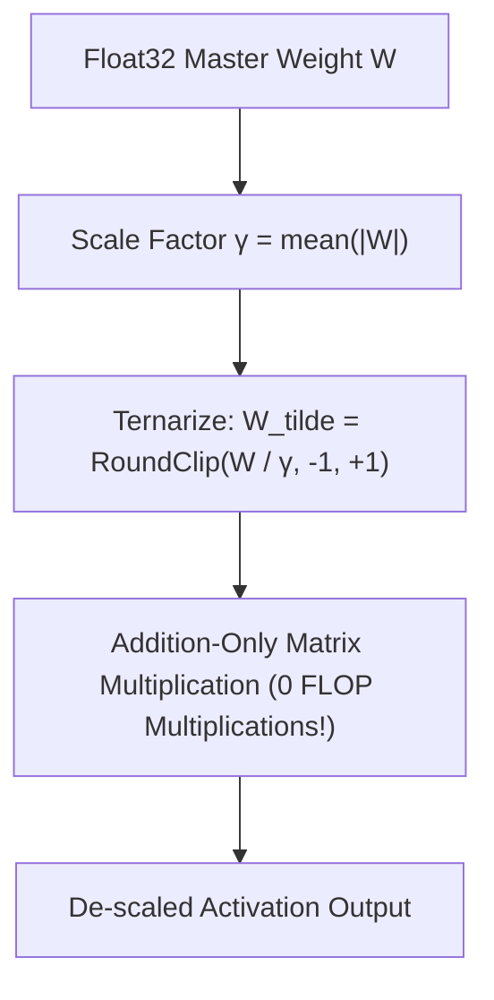

# BitNet b1.58: The Era of 1.58-Bit LLMs

This document explains the mathematical foundations, Quantization-Aware Training (QAT), and Straight-Through Estimator (STE) autograd mechanics of **BitNet b1.58** (Microsoft Research).

---

## 1. Why 1.58 Bits? ($\log_2(3) \approx 1.58496$)

Standard Float32 model weights require 32 bits (4 bytes) per parameter.
In BitNet b1.58, every weight matrix value is constrained to a discrete ternary set:

$$W_{ij} \in \{-1, \, 0, \, +1\}$$

Because a ternary choice contains 3 distinct states, the information capacity per weight is:

$$\text{Bits per parameter} = \log_2(3) \approx 1.58496 \text{ bits}$$



---

## 2. Zero-Multiplication Matrix Algebra

In standard matrix multiplication $Y = W \cdot X$:
$$Y_i = \sum_{j=1}^{d} W_{ij} X_j$$

Because $W_{ij} \in \{-1, 0, +1\}$, **floating-point multiplications are completely eliminated**:

* $W_{ij} = +1 \implies \text{Add } X_j$
* $W_{ij} = -1 \implies \text{Subtract } X_j$
* $W_{ij} = 0 \implies \text{Do nothing}$

This replaces energy-intensive floating-point multiply-accumulate (MAC) circuits with simple integer additions and subtractions, slashing hardware inference energy consumption by **up to 95%**.

---

## 3. Straight-Through Estimator (STE) Autograd

Because the rounding and clamping operations ($\text{RoundClip}$) are non-differentiable (zero gradient almost everywhere), standard backpropagation fails.

We use a **Straight-Through Estimator (STE)** (Bengio et al.):

1. **Forward Pass**: Uses the quantized ternary weights $\widetilde{W} \in \{-1, 0, +1\}$.
2. **Backward Pass**: Passes gradients $\frac{\partial \mathcal{L}}{\partial \widetilde{W}}$ directly to the FP32 master weights $W$:

$$\frac{\partial \mathcal{L}}{\partial W} \approx \frac{\partial \mathcal{L}}{\partial \widetilde{W}}$$

```python
class STETernaryQuantize(torch.autograd.Function):
    @staticmethod
    def forward(ctx, weight: torch.Tensor) -> torch.Tensor:
        gamma = weight.abs().mean().clamp(min=1e-5)
        quantized = torch.round(weight / gamma).clamp(-1.0, 1.0)
        return quantized * gamma

    @staticmethod
    def backward(ctx, grad_output: torch.Tensor) -> torch.Tensor:
        # STE: Pass gradient straight through to FP32 master weights
        return grad_output
```

---

## 4. Training a BitNet Model

Run `scripts/train_bitnet.py` to train a 1.58-bit BitNetLLM model:

```bash
uv run python scripts/train_bitnet.py --epochs 5 --batch-size 16
```

This saves the trained ternary model checkpoint to `checkpoints/bitnet_llm.pth`.
