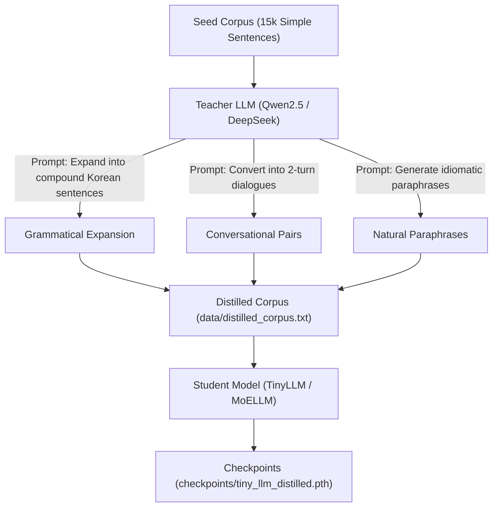

# Knowledge Distillation: Transferring Intelligence from Large LLMs

This document explains the theory, implementation, and workflow for distilling large state-of-the-art models (like **Qwen2.5-7B** or **DeepSeek-R1**) into `TinyLLM` / `MoELLM`.

---

## 1. Overview: What is Sequence-Level Knowledge Distillation?

Training a 2M-parameter model on a small, simple dataset (e.g. 15k basic Korean sentences) results in limited vocabulary expressiveness and repetitive outputs.

In **Sequence-Level Knowledge Distillation** (Kim & Rush):
1. A large **Teacher LLM** (7B–70B parameters) acts as a dataset expansion engine.
2. The Teacher takes simple seed sentences and generates rich, complex compound sentences, dialogues, and paraphrases.
3. The small **Student Model** (`TinyLLM`) trains on this distilled synthetic corpus using its own native 4,000-token BPE tokenizer.



---

## 2. Why Sequence-Level Distillation Outperforms Logit Matching

| Feature | Direct Logit Distillation ($D_{\text{KL}}$) | Sequence-Level Distillation |
| :--- | :--- | :--- |
| **Tokenizer Dependency** | Requires matching vocabulary sizes & subword splits | **Zero Tokenizer Overhead** (Student uses native 4k BPE) |
| **Parameter Scale Gap** | Overburdens 2M student trying to mimic 7B logits | **Scales Naturally** (Student learns clean text patterns) |
| **Local LLM Compatibility** | Complex tensor alignment | Works out-of-the-box with **Ollama / DeepSeek / OpenAI APIs** |

---

## 3. Step-by-Step Distillation Guide

### Step 1: Generate Synthetic Distilled Corpus
Run `scripts/distill_generate.py` to query your local Ollama or remote LLM API endpoint:

```bash
# Using local Ollama with Qwen2.5
uv run python scripts/distill_generate.py --endpoint http://localhost:11434/v1 --model qwen2.5:7b --max-samples 100

# Or using DeepSeek API
uv run python scripts/distill_generate.py --endpoint https://api.deepseek.com/v1 --model deepseek-chat --api-key YOUR_API_KEY
```

This creates `data/distilled_corpus.txt`.

### Step 2: Train the Student Model
Run `scripts/distill_train.py` to train `TinyLLM` (or `MoELLM`) on the distilled corpus:

```bash
# Train standard TinyLLM student
uv run python scripts/distill_train.py --epochs 5

# Or train an advanced MoELLM (GQA + MoE) student
uv run python scripts/distill_train.py --use-moe --epochs 5
```

This outputs the distilled checkpoint to `checkpoints/tiny_llm_distilled.pth`.
