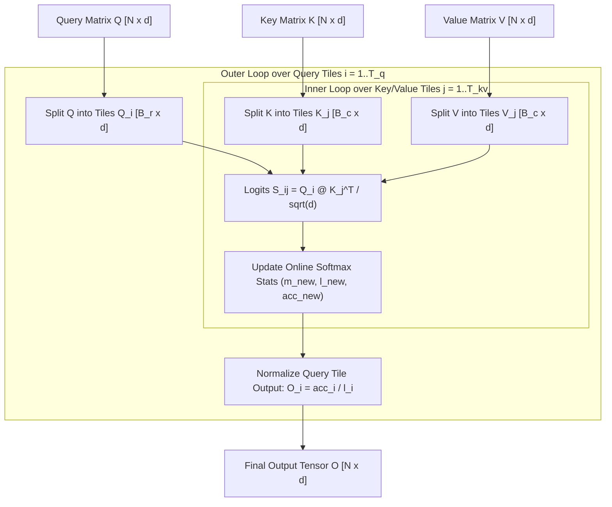

# Educational FlashAttention: Tiled Online Softmax

This document explains the mathematics, memory I/O bottleneck, and implementation details of **FlashAttention** (Dao et al.) using pure Python and PyTorch (`EducationalFlashAttention`).

---

## 1. Motivation: The Memory Wall

In standard Attention:

$$S = \frac{Q K^T}{\sqrt{d}} \in \mathbb{R}^{B \times N \times N}$$
$$P = \text{Softmax}(S) \in \mathbb{R}^{B \times N \times N}$$
$$O = P V \in \mathbb{R}^{B \times N \times d}$$

### Why Standard Attention is Memory Bound:
* Calculating $S$ and $P$ requires allocating $N \times N$ matrix shapes in High Bandwidth Memory (GPU VRAM / RAM).
* For sequence length $N=4096$, storing $P$ takes $4096 \times 4096 \times 4 \text{ bytes} \approx 67 \text{ MB}$ per head, per layer, per batch.
* Reading and writing $S$ and $P$ to global memory takes $O(N^2)$ memory bandwidth transfers, causing the GPU/CPU compute engines to sit idle waiting for RAM/VRAM transfers.

---

## 2. The FlashAttention Algorithm: Tiled Online Softmax

FlashAttention splits $Q$, $K$, and $V$ into small blocks ($B_r \times d$) that fit entirely within fast L1/SRAM cache, computing the exact mathematical attention output **with zero $N \times N$ memory allocations**.



---

## 3. Mathematical Update Rules

For a Query block $Q_i$ and Key/Value block $K_j, V_j$, we compute partial logits:

$$S_{ij} = \frac{Q_i K_j^T}{\sqrt{d}}$$

Instead of waiting for all Key blocks before applying softmax, we maintain three running statistics per Query block row:

1. **Running Row Max ($m_{new}$)**:
   $$m_{new} = \max\left(m_{old}, \, \text{rowmax}(S_{ij})\right)$$

2. **Rescale Factors**:
   $$\alpha = e^{m_{old} - m_{new}}, \quad P_{ij} = e^{S_{ij} - m_{new}}$$

3. **Running Partition Function / Exponential Sum ($l_{new}$)**:
   $$l_{new} = \alpha \cdot l_{old} + \text{rowsum}(P_{ij})$$

4. **Running Output Accumulator ($acc_{new}$)**:
   $$acc_{new} = \alpha \cdot acc_{old} + P_{ij} V_j$$

After iterating over all Key/Value blocks $j$, the final exact normalized output for Query tile $i$ is:

$$O_i = \frac{acc_i}{l_i}$$

---

## 4. PyTorch Usage Example

```python
import torch
from tiny_llm import EducationalFlashAttention, precompute_freqs_cis

# Initialize FlashAttention module with block tile size of 16
flash_attn = EducationalFlashAttention(dim=128, n_heads=4, block_size=16)

# Generate dummy inputs
batch_size, seq_len, dim = 2, 64, 128
x = torch.randn(batch_size, seq_len, dim)
freqs_cis = precompute_freqs_cis(dim // 4, seq_len)

# Forward pass (Zero N x N matrix allocations)
output = flash_attn(x, freqs_cis)
print(output.shape) # [2, 64, 128]
```
