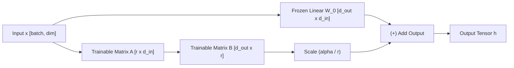

# Low-Rank Adaptation (LoRA) from Scratch

This document explains the mathematical foundations, parameter efficiency, and implementation of **LoRA (Low-Rank Adaptation)** in `tiny_llm`.

---

## 1. Concept & Theoretical Motivation

When fine-tuning large language models on downstream tasks, full fine-tuning requires updating all weight parameters $W_0 \in \mathbb{R}^{d_{out} \times d_{in}}$. This is computationally expensive and memory intensive.

**LoRA Insight (Hu et al.)**: The weight updates $\Delta W$ during adaptation have a very low "intrinsic rank" $r \ll \min(d_{in}, d_{out})$.

Instead of updating $W_0$ directly:
1. We **freeze** the base weight matrix $W_0$ ($\text{requires\_grad} = \text{False}$).
2. We parameterize the weight update $\Delta W$ as the matrix product of two low-rank matrices $A$ and $B$:

$$\Delta W = \left(\frac{\alpha}{r}\right) B \cdot A$$

where:
* $A \in \mathbb{R}^{r \times d_{in}}$ (initialized with Kaiming uniform noise)
* $B \in \mathbb{R}^{d_{out} \times r}$ (initialized to zero, so $\Delta W = 0$ at step 0)
* $r$ is the rank rank (e.g. $r=4$ or $r=8$)
* $\alpha$ is a scaling hyperparameter



---

## 2. Parameter Reduction Analysis

For a standard projection layer with $d_{in} = 512, d_{out} = 512$:
* **Standard Linear Layer**: $512 \times 512 = 262,144$ parameters.
* **LoRA Layer ($r=4$)**:
  * Matrix $A$: $4 \times 512 = 2,048$
  * Matrix $B$: $512 \times 4 = 2,048$
  * **Total**: $4,096$ trainable parameters (**98.4% reduction!**).

---

## 3. Weight Merging for Zero-Latency Inference

During inference, we don't need to compute two separate matrix multiplications ($W_0 x + \Delta W x$). We can merge the low-rank adapter weights directly into the base weights:

$$W_{\text{merged}} = W_0 + \left(\frac{\alpha}{r}\right) B \cdot A$$

`merge_lora(model)` converts all `LoRALinear` layers back into standard `nn.Linear` layers with merged weights, producing zero inference latency overhead.

---

## 4. PyTorch Usage Example

```python
from tiny_llm import TinyLLM, inject_lora, merge_lora

# 1. Load base pre-trained model
model = TinyLLM(vocab_size=4000, dim=128)

# 2. Inject LoRA adapters into Q & V projections (rank r=4)
model = inject_lora(model, r=4, target_modules=("wq", "wv"))

# 3. Optimize ONLY trainable LoRA parameters
optimizer = torch.optim.AdamW([p for p in model.parameters() if p.requires_grad], lr=1e-3)

# 4. Merge weights after fine-tuning for zero-overhead export
merged_model = merge_lora(model)
```
