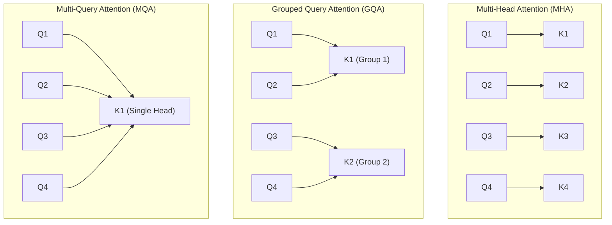
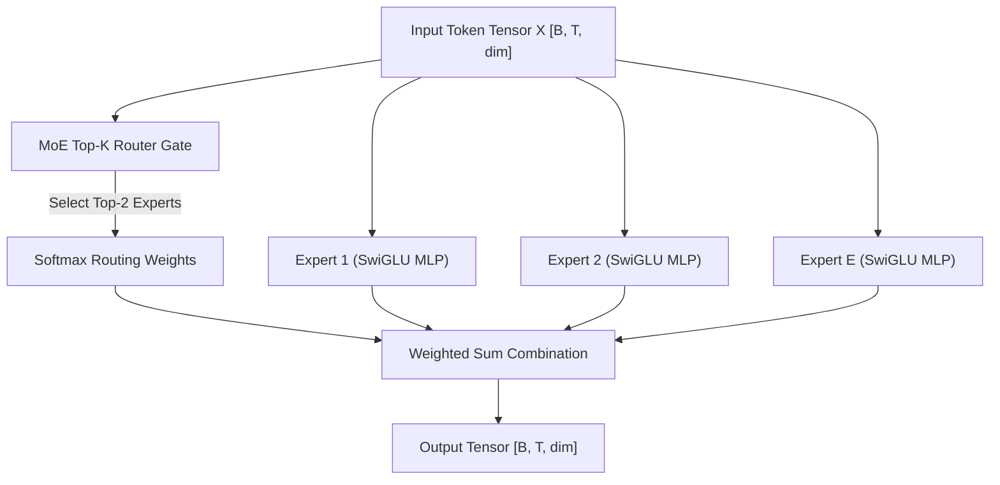

# Advanced Architecture: GQA & MoE

This document explains the concepts, mathematical formulas, and implementation details of **Grouped Query Attention (GQA)** and **Mixture-of-Experts (MoE)** in `MoELLM`.

---

## 1. Overview & Motivation

Standard dense Llama-style transformers (`TinyLLM`) utilize:
1. **Multi-Head Attention (MHA)**: Every Query head has its own dedicated Key and Value head.
2. **Dense Feed-Forward Networks (SwiGLU)**: Every single token passes through the exact same large MLP.

As models scale up, MHA creates massive memory bandwidth bottlenecks during autoregressive inference (due to storing full Key/Value caches), and dense MLPs consume vast compute budgets for every token.

`MoELLM` solves both bottlenecks:
* **GQA** shrinks the Key/Value cache size by sharing Key/Value heads across groups of Query heads.
* **MoE** turns the MLP block into a sparse network where a **Top-K Router** dynamically assigns each token to only a small subset of "expert" MLPs.

---

## 2. Grouped Query Attention (GQA)

### MHA vs. MQA vs. GQA



### Mathematical Formulation

Given $N_q$ Query heads and $N_{kv}$ Key/Value heads ($N_{kv} \le N_q$), we calculate the head repetition ratio:

$$N_{rep} = \frac{N_q}{N_{kv}}$$

During the forward pass:
1. Query projection: $Q \in \mathbb{R}^{B \times T \times N_q \times d_{head}}$
2. Key projection: $K \in \mathbb{R}^{B \times T \times N_{kv} \times d_{head}}$
3. Value projection: $V \in \mathbb{R}^{B \times T \times N_{kv} \times d_{head}}$
4. We expand $K$ and $V$ along the head dimension by repeating each Key/Value head $N_{rep}$ times:

$$\text{repeat\_kv}(K) \in \mathbb{R}^{B \times N_q \times T \times d_{head}}$$

5. Standard attention scores are then computed:

$$\text{Attention}(Q, K, V) = \text{Softmax}\left( \frac{Q \cdot \text{repeat\_kv}(K)^T}{\sqrt{d_{head}}} + M \right) \cdot \text{repeat\_kv}(V)$$

### Benefits
* **KV Cache Memory Reduction**: Shrinks the KV cache size by a factor of $N_{rep}$ (e.g., $4\times$ smaller cache if $N_q=8, N_{kv}=2$).
* **Faster Generation**: Reduces memory bandwidth throughput requirements during step-by-step autoregressive text generation.

---

## 3. Mixture-of-Experts (MoE)

In a Mixture-of-Experts architecture, the standard single MLP is replaced by a **Gating Network (Router)** and $E$ parallel **Expert MLPs**.



### Top-K Routing Math

1. **Routing Logits**: Compute gating scores for each of the $E$ experts:
   $$H(x) = x \cdot W_{gate} \quad \text{where } W_{gate} \in \mathbb{R}^{dim \times E}$$

2. **Top-K Selection**: Select the $K$ highest scoring experts ($K=2$ by default):
   $$\text{indices} = \text{TopK}(H(x), K)$$

3. **Softmax Weighting**: Apply softmax over the selected $K$ logits to compute normalized routing weights:
   $$w_k = \frac{e^{H(x)_{\text{indices}_k}}}{\sum_{j=1}^K e^{H(x)_{\text{indices}_j}}}$$

4. **Expert Execution & Combination**: The final output for token $x$ is the weighted sum of outputs from the selected experts:
   $$y = \sum_{k=1}^K w_k \cdot \text{Expert}_{\text{indices}_k}(x)$$

---

## 4. `MoELLM` Code Usage

```python
from tiny_llm import MoELLM, MoELLMConfig

# 1. Define configuration with GQA and MoE parameters
config = MoELLMConfig(
    vocab_size=4000,
    dim=128,
    n_layers=4,
    n_heads=4,
    n_kv_heads=2,          # GQA: 4 Query heads share 2 Key/Value heads
    ffn_dim=512,
    num_experts=8,         # MoE: 8 expert MLPs per layer
    num_experts_per_tok=2, # MoE: Route each token to 2 experts
    max_seq_len=128
)

# 2. Instantiate model
model = MoELLM(config=config)

# 3. Forward pass
import torch
tokens = torch.randint(0, 4000, (2, 16)) # [batch=2, seq_len=16]
logits = model(tokens)                   # [2, 16, 4000]
```
