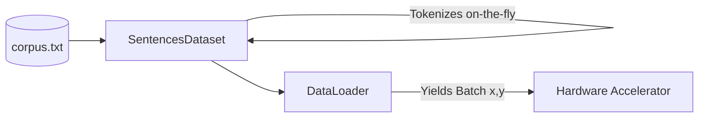

# Training TinyLLM

This document outlines the end-to-end training pipeline for the TinyLLM model, detailing the dataset preparation, hardware utilization, hyperparameter choices, and the training loop implementation.

## 1. Prerequisites and Setup
The training relies on several custom modules defined in the repository:
- `data.py`: Handles loading text and batching.
- `model.py`: The core LLM architecture.
- `tokenizer.json`: A pre-trained HuggingFace `Tokenizer` (usually Byte-Level BPE) representing the vocabulary of the target language/corpus.
- `corpus.txt`: The raw text data used to train the model.

## 2. Dataset and Dataloader
The script uses a PyTorch `DataLoader` to efficiently feed batches to the GPU/CPU.



- **Dataset Class**: `SentencesDataset` (from `data.py`) takes the raw `corpus.txt` and tokenizes the text on the fly or pre-processes it.
- **Max Sequence Length**: Set to `64`. Text longer than this is either truncated or split, and shorter text is padded.
- **Batch Size**: `32`. At every training step, the model processes 32 sequences of 64 tokens in parallel.

## 3. Hardware Acceleration
The script automatically detects and utilizes the best available hardware.
```python
device = torch.device("cuda" if torch.cuda.is_available() else "cpu")
```
*(Note: Mac MPS support can also be easily integrated into this pipeline).* 
The model weights and all data batches (`x`, `y`) are shipped to this `device` to ensure fast matrix multiplications.

## 4. Hyperparameters
- **Optimizer**: `AdamW` (Adam with Weight Decay). A standard for training modern transformers as it regularizes the model better than standard Adam.
- **Learning Rate**: `1e-3` (0.001). Since this is a "tiny" LLM (few parameters), it can tolerate a relatively high learning rate compared to massive models which typically use `1e-4` or `1e-5`.
- **Epochs**: `10`. The model iterates over the entire `corpus.txt` dataset 10 times.

## 5. Loss Function
The model is trained using **Cross Entropy Loss**.
```python
pad_idx = tokenizer.token_to_id("[PAD]")
criterion = nn.CrossEntropyLoss(ignore_index=pad_idx)
```
**Important detail**: The `ignore_index` argument is passed to the loss function. When sequences are shorter than 64 tokens, they are padded with `[PAD]`. By ignoring the `[PAD]` index, we prevent the model from artificially reducing its loss by learning to predict useless padding tokens.

## 6. The Training Loop
The training loop (`train()`) follows the standard PyTorch auto-regressive prediction paradigm:

```mermaid
sequenceDiagram
    participant Batch as Dataloader
    participant Model as TinyLLM
    participant Loss as CrossEntropy
    participant Opt as AdamW Optimizer

    Batch->>Model: Provide sequence x
    Model->>Model: Forward pass
    Model->>Loss: Return logits
    Batch->>Loss: Provide target sequence y
    Loss->>Loss: Compute Error
    Loss->>Opt: Backpropagate (loss.backward)
    Opt->>Model: Update weights (step)
    Opt->>Opt: Zero gradients (zero_grad)
```

1. **Forward Pass**: The batch of inputs (`x`) is passed through `TinyLLM` to generate `logits`.
2. **Reshaping**: To compute loss across the whole sequence, logits are flattened from `[batch, seq_len, vocab_size]` to `[batch * seq_len, vocab_size]`. The targets (`y`) are flattened to `[batch * seq_len]`.
3. **Loss Computation**: `criterion(logits, y)` measures how far the predicted probabilities were from the actual next tokens.
4. **Backward Pass**: `loss.backward()` computes the gradients using backpropagation.
5. **Optimization**: `optimizer.step()` updates the model's weights.
6. **Zeroing Gradients**: `optimizer.zero_grad()` clears the gradients for the next batch.

Throughout the epoch, the script prints the loss every 100 batches to allow for real-time monitoring of convergence.

## 7. Saving the Model
Upon completing all 10 epochs, the raw PyTorch state dictionary (the learned weights and biases) is saved to disk:
```python
torch.save(model.state_dict(), "tiny_llm.pth")
```
This `.pth` file is subsequently used by `generate.py` or the Streamlit `interpretability.py` dashboard for inference and analysis.
